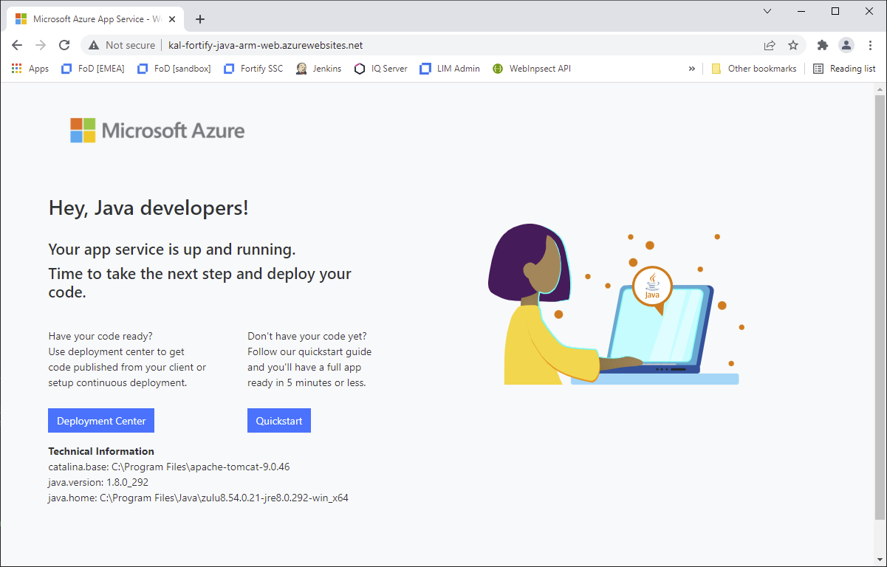

# Fortify scanning of Azure Resource Manager (ARM) templates

This is an example project for the demonstration of Fortify vulnerability scanning of [Azure Resource Manager (ARM)](https://azure.microsoft.com/en-gb/features/resource-manager/) templates. It also includes the source code for a simple Java application so that both application code and infrastructure code can be scanned simultaneously.

To use this demo in full you will need the following software installed:

* [Visual Studio Code](https://code.visualstudio.com/)
* Visual Studio Code [Azure Resource Manager tools](https://marketplace.visualstudio.com/items?itemName=msazurermtools.azurerm-vscode-tools) extension
* [Fortify SCA and Tools](https://www.microfocus.com/en-us/cyberres/application-security/static-code-analyzer) (21.2 or later is required for Azure Resource Manager rules)
* Visual Studio Code [Fortify](https://marketplace.visualstudio.com/items?itemName=fortifyvsts.fortify-extension-for-vs-code) extension
* [Azure PowerShell module](https://docs.microsoft.com/en-us/powershell/azure/install-az-ps) installed and authenticated

Setup
-----

If you want to deploy the application to Azure you will need to choose a unique name, it is recommend
you choose something along the line of `[your-initials]-fortify-java-arm`, e.g. `kal-fortify-java-arm`.

First create a file called `.env` in the project root directory with content similar to the following:

```
# The URL of Software Security Center
SSC_URL=http://ftfydemo:8080/ssc
SSC_USERNAME=admin
SSC_PASSWORD=admin
# SSC Authentication Token (recommended to use CIToken)
SSC_AUTH_TOKEN=XXXXX
# Name of the application in SSC
SSC_APP_NAME=FortifyAzureRMDemo
# Name of the application version in SSC
SSC_APP_VER_NAME=main
# Azure (Resource Manager)
# Your Azure subscription id
AZURE_SUBSCRIPTION_ID=XXXXX
AZURE_RESOURCE_GROUP=xxx-fortify-java-arm
# The name of the App, replace "xxx-fortify-java-arm" with a unique name, e.g. "[your_initials]-fortify-java-arm"
AZURE_APP_NAME=fortify-java-armWeb
# Your desired Azure region, note not all regions allow MySQL databases to be created
AZURE_REGION=eastus
```

Make sure you set an appropriate value for `AZURE_SUBSCRIPTION_ID`, and if you want to upload the results to Fortify
Software Security Center, update `SSC_URL` and `SSC_AUTH_TOKEN` as well.

Next update the file `azuredeploy.parameters.json` with content similar to the following, please use the same
unique name as chosen above for the `appDnsPrefix` element:

```
{
    "$schema": "https://schema.management.azure.com/schemas/2019-04-01/deploymentParameters.json#",
    "contentVersion": "1.0.0.0",
    "parameters": {
        "appDnsPrefix": {
            "value": "kal-fortify-java-arm"
        },
        "mySqlAdminLogin": {
            "value": "mysql"
        },
        "mySqlAdminPassword": {
            "value": "Password123!"
        }
    }
}
```

Security Scan
-------------

To run a Fortify Static Code Analyzer scan (from a PowerShell console) you can use the included script `fortify-sca.ps1` as follows:

```
.\gradlew.bat build
.\bin\fortify-sca.ps1
```

This will scan the Java applications source code and the Azure Resource Management infrastructure definition.

An example results file  (in PDF) is available [here](samples/JavaARMDemo.pdf).

To view the full results yourself you can use:

```
auditworkbench .\FortifyAzureRMDemo.fpr
```

There should be a number of Azure Resource Manager issues (as well as some Java issues) including (but not limited to):

- Azure Resource Manager Misconfiguration: Insecure Transport
  (Caused by the app service not encoring HTTPS)
- Insecure Transport: Azure Storage
- Insecure Transport: Database
- Insecure Transport: Weak SSL Protocal
- Access Control: Azure Storage
- Azure Resource Manager: Overly Permissive CORS Policy  

Run Application (locally)
-------------------------

If you want to run the Java application locally you will need to have [MySQL](https://www.mysql.com/) installed and set a system
environment called `MYSQLCONNSTR_defaultConnection` with a value similar to the following:

```
Database=armdemo;Data Source=localhost;User Id=root;Password=root
```

Make sure the userid/password is valid for your local MySQL instance and that the database refered to is already created.

You can the run the application using the following:

```
.\gradlew.bat build tomcatRun
```

The application should then be available at the URL: `http://localhost:8080/AzureRMDemo`. If it fails to start make sure you have
no other applications running on port 8080.

To stop the application, in another console, run the following:

```
.\gradlew.bat tomcatStop
```


Deploy Infrastructure
---------------------

If you want build/deploy the Azure infrastructure from the included Azure Resource Manager template, carry out the following
(from aPowerShell console):    

```
New-AzResourceGroup -Name fortify-java-arm-demo -Location eastus
New-AzResourceGroupDeployment -ResourceGroupName fortify-java-arm-demo -TemplateFile ./azuredeploy.json -TemplateParameterFile ./azuredeploy.parameters.json
```

Replace `eastus` with your own region

Note: it will take a few minutes to create all of the infrastructure.

You can navigate to the [Azure portal](https://portal.azure.com/#home) and see the infrastructure as its is created.
You can also navigate to the Web application itself (shown as the output `webAppUrl` from the `New-AzResourceGroupDeployment` command) 
and you should see a screen similar to the below:



Deploy Application
------------------

Once the infrastructure has been completed, you can deploy the web application using the following:

```
.\gradlew.bat azureWebAppDeploy
```

After a few minutes refresh the Web application (as listed as on output from the `New-AzResourceGroupDeployment` command) and your should see the screen below:


Remove Application and Infrastructure
-------------------------------------

To clean up all the resources you can execute the following (from a PowerShell console):

```
Remove-AzResourceGroup -Name fortify-java-arm-demo
```

---

Kevin A. Lee - kevin.lee@microfocus.com
